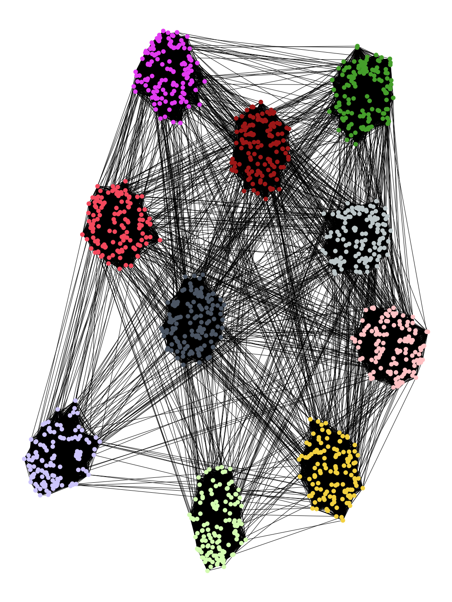
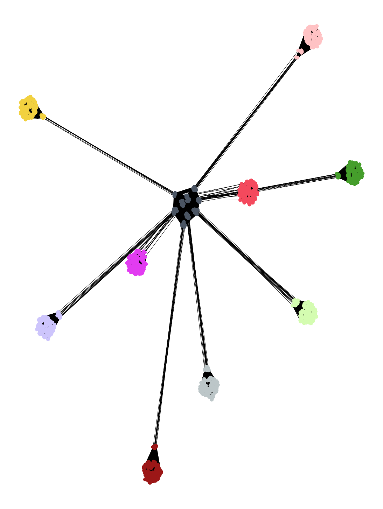

# Simplified_LFR_Benchmark_Graph
A Simplified version of popular LFR benchmark algorithm

## Description
**Lancichinetti–Fortunato–Radicchi benchmark (LFR)** is an algorithm that generates artificial networks with a known community structure, while taking into account the heterogeneity in the distributions of node degrees and community sizes. [Networkx](https://networkx.org/documentation/stable/reference/generated/networkx.generators.community.LFR_benchmark_graph.html), a popular Python package for complex networks analysis provides a function to generate this graph structure, which relies on degree sequence & power law distribution. We removed this dependence by incorprating each community as a respective subgraph, where each graph is conneceted with a probability mu to generate the desired community structures. All possible graph configurations in the range [0, 1] can be generated.

<div>
  <figure>
    
  </figure>
  <figure>
    
  </figure>
</div>

### Example

```bash
#example
Nodes = 1280                 #SPECIFY NUMBER OF NODES
communities = 10             #SPECIFY NUMBER OF COMMUNITIES
edge_probability = 0.5       #INTRA-DENSITY, [0,1]
mu =  0.5                    #INTER-DENSITY, [0,1]
G, communities = generate_graph(n = Nodes, c = communities, p = edge_probability, mu = mu)
intra, inter  = density_calculation(G =G , communities = communities)
```

## Benefits
- Faster computation time, computationally inexpensive
- Only depends on 4 variables
- Returns Graph along with average inter & intra density
- Includes visulaization of generated graph 

## License

**Simplified_LFR_Benchmark_Graph** is released under the GNU General Public License v3.0. Please see the [LICENSE](LICENSE) file for more information.

## Contributing

We actively welcome your pull requests! Please see [`CONTRIBUTING.md`](docs/CONTRIBUTING.md) and [`CODE_OF_CONDUCT.md`](docs/CODE_OF_CONDUCT.md) for more info.
